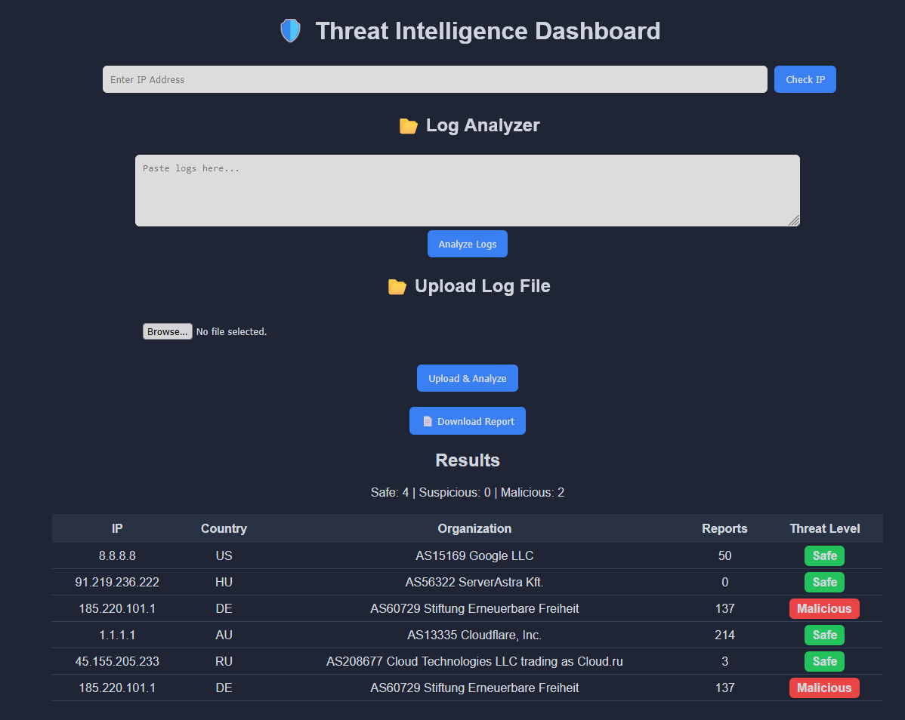
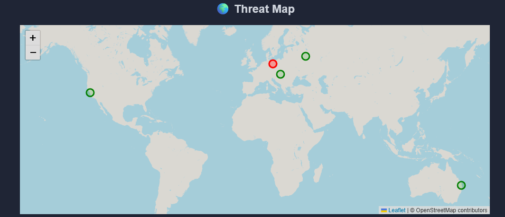
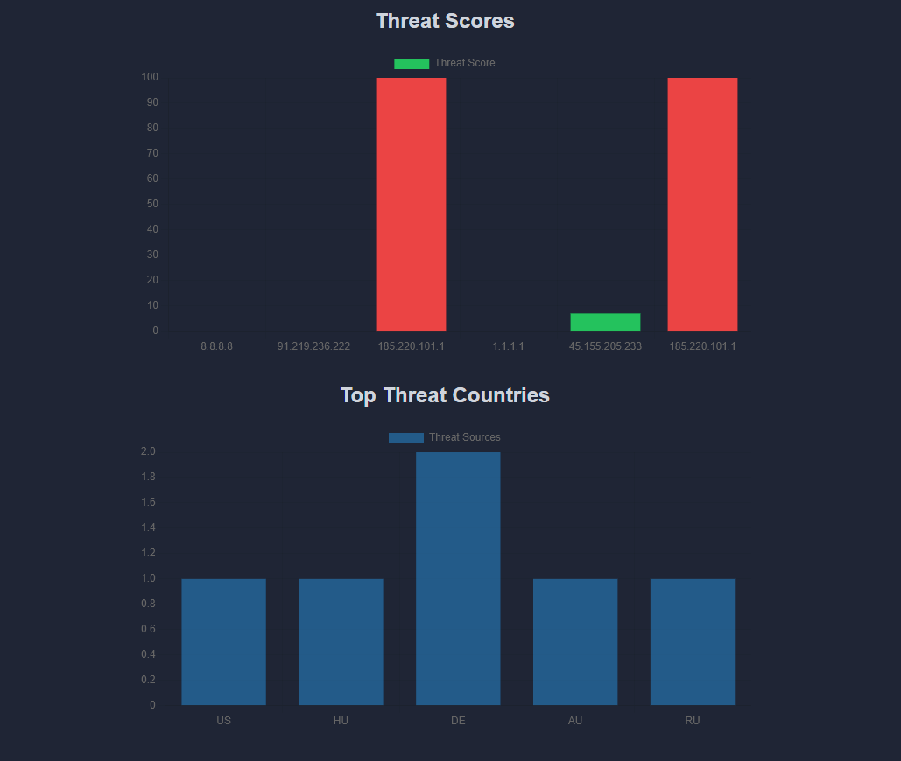

# 🛡️ Threat Intelligence IP Tracker

A **cybersecurity dashboard** that analyzes IP addresses using real-world threat intelligence APIs, processes logs, and visualizes malicious activity on an interactive map.

---

## 🚀 Overview

This project simulates real **Security Operations Center (SOC)** workflows by combining:

* Threat intelligence analysis
* Log investigation
* Malicious IP detection
* Data visualization

---

## 📷 Screenshots

### 🔍 Dashboard



### 🌍 Threat Map



### 📊 Analytics



---

## 🚀 Features

* 🔍 **IP Lookup** — Analyze any IP address for threat intelligence data
* 📂 **Log Analyzer** — Paste logs or upload `.txt` files to extract and analyze IPs
* 🌍 **Threat Map** — Visualize IP origins on an interactive world map
* 📊 **Charts & Analytics** — View threat scores and top attacking countries
* 📄 **CSV Export** — Download analysis reports
* 🌙 **Dark Mode Dashboard** — SOC-style interface

---

## 🧠 Technologies Used

* Python (Flask)
* REST APIs (AbuseIPDB, IPInfo)
* HTML / CSS / JavaScript
* Chart.js
* Leaflet.js

---

## ⚙️ Setup Instructions

### 1️⃣ Clone the repository

```bash
git clone https://github.com/eliazar-lopez/threat-intel-ip-tracker.git
cd threat-intel-ip-tracker
```

### 2️⃣ Install dependencies

```bash
pip install -r requirements.txt
```

### 3️⃣ Set up environment variables

Create a `.env` file in the root directory:

```env
ABUSE_API_KEY=your_abuseipdb_key_here
IPINFO_KEY=your_ipinfo_key_here
```

### 4️⃣ Run the application

```bash
python app.py
```

Then open your browser:

```
http://127.0.0.1:5000
```

---

## 🧪 Usage

### 🔍 Single IP Lookup

Enter an IP address to analyze threat intelligence data.

### 📂 Log Analyzer

Paste logs like:

```
Failed login from 185.220.101.1
Connection attempt from 45.155.205.233
```

Or upload a `.txt` file to automatically extract and analyze IPs.

---

## 🔐 Security

API keys are stored securely using environment variables and are excluded from the repository using `.gitignore`.

---

## 💼 Why This Project Matters

This project demonstrates practical cybersecurity skills used in real SOC environments:

* Threat intelligence analysis
* Log parsing and investigation
* Identifying malicious IP activity
* Dashboard-based security reporting
* Secure handling of API credentials

---

## 📌 Future Improvements

* 🔄 Real-time monitoring
* 🧠 Attack pattern detection (brute force, scanning)
* 🌍 Enhanced geo-mapping
* 🔐 User authentication

---

## 👤 Author

**Eliazar Lopez**
GitHub: https://github.com/eliazar-lopez
