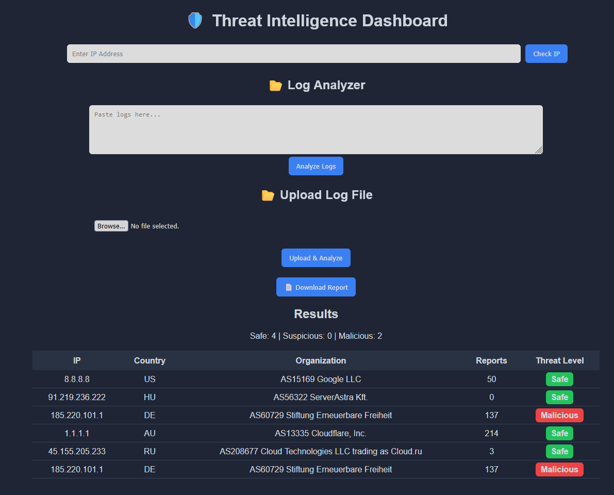
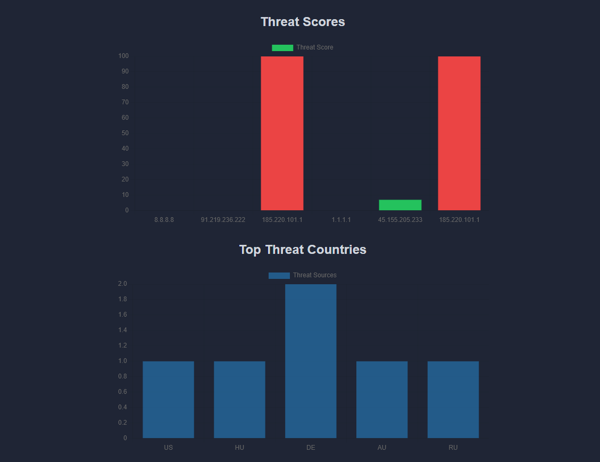
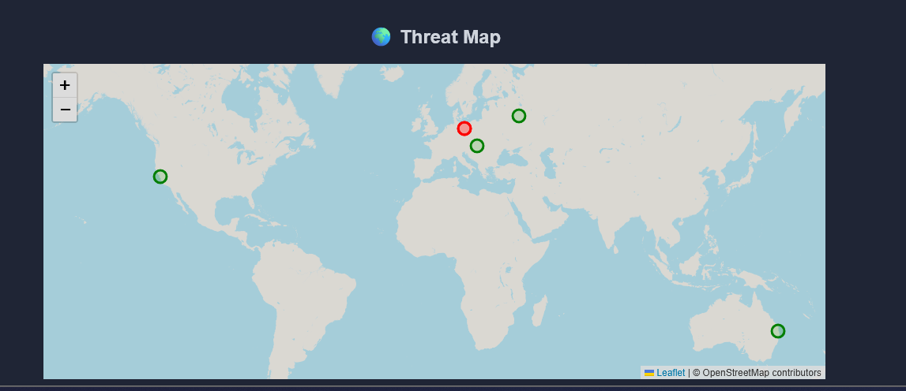

# 🛡️ Threat Intelligence IP Tracker

A web-based cybersecurity dashboard that analyzes IP addresses using real-world threat intelligence APIs and visualizes potential malicious activity.

---

## 🚀 Features

* 🔍 **IP Lookup** — Analyze any IP address for threat intelligence data
* 📂 **Log Analyzer** — Paste logs or upload `.txt` files to extract and analyze IPs automatically
* 🌍 **Threat Map** — Visualize IP origins on an interactive world map
* 📊 **Charts & Analytics** — View threat scores and top attacking countries
* 📄 **CSV Export** — Download analysis reports
* 🌙 **Dark Mode Dashboard** — Clean, SOC-style interface

---

## 🧠 Technologies Used

* Python (Flask)
* REST APIs (AbuseIPDB, IPInfo)
* HTML / CSS / JavaScript
* Chart.js (data visualization)
* Leaflet.js (map visualization)

---

## ⚙️ Setup Instructions

### 1️⃣ Clone the repository

```
git clone https://github.com/YOUR_USERNAME/threat-intel-ip-tracker.git
cd threat-intel-ip-tracker
```

---

### 2️⃣ Install dependencies

```
pip install -r requirements.txt
```

---

### 3️⃣ Set up environment variables

Create a `.env` file in the root directory:

```
ABUSE_API_KEY=your_abuseipdb_key_here
IPINFO_KEY=your_ipinfo_key_here
```

---

### 4️⃣ Run the application

```
python app.py
```

Then open your browser:

```
http://127.0.0.1:5000
```

---

## 🧪 Usage

### 🔍 Single IP Lookup

Enter an IP address to analyze threat intelligence data.

---

### 📂 Log Analyzer

Paste logs like:

```
Failed login from 185.220.101.1
Connection attempt from 45.155.205.233
```

Or upload a `.txt` file to automatically extract and analyze IPs.

---

### 📊 Dashboard

* View threat scores
* Identify malicious IPs
* See attack origins by country
* Visualize activity on a world map

---

## 🔐 Security Note

API keys are stored securely using environment variables (`.env`) and are not included in the repository.

---

## 💼 Project Purpose

This project simulates real-world **Security Operations Center (SOC)** workflows:

* Threat intelligence analysis
* Log investigation
* Malicious IP identification
* Data visualization and reporting

---

## 📌 Future Improvements

* 🔄 Real-time monitoring
* 🧠 Attack pattern detection (brute force, scanning)
* 🌍 Enhanced geo-mapping
* 🔐 User authentication

---

## 📷 Screenshots (Add your own)




---

## 👤 Author

Eliazar Lopez
GitHub: https://github.com/eliazar-lopez